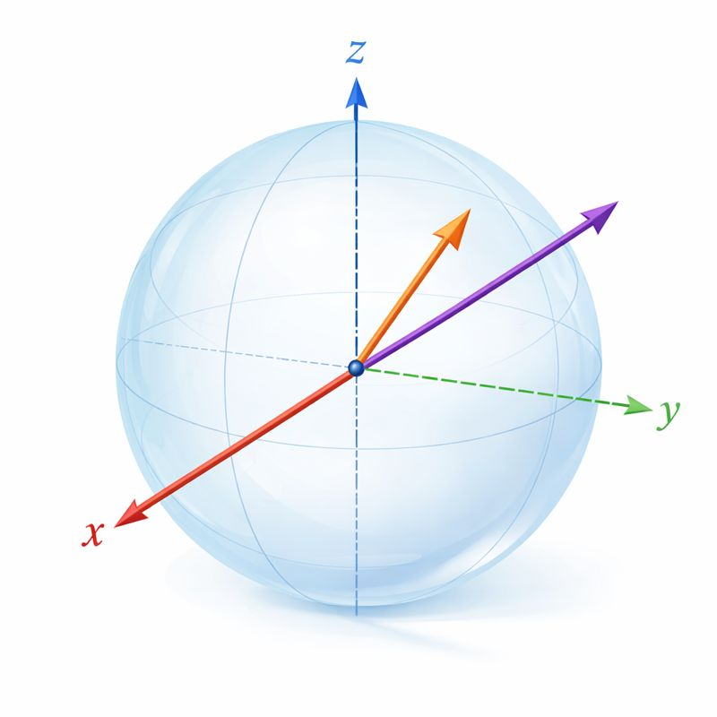
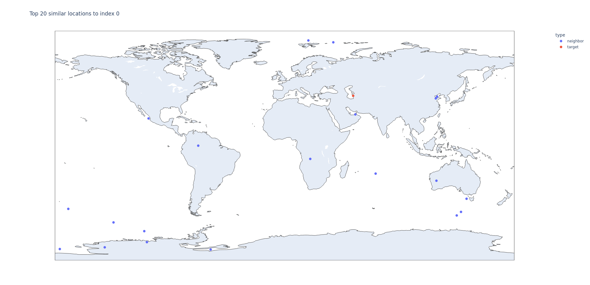
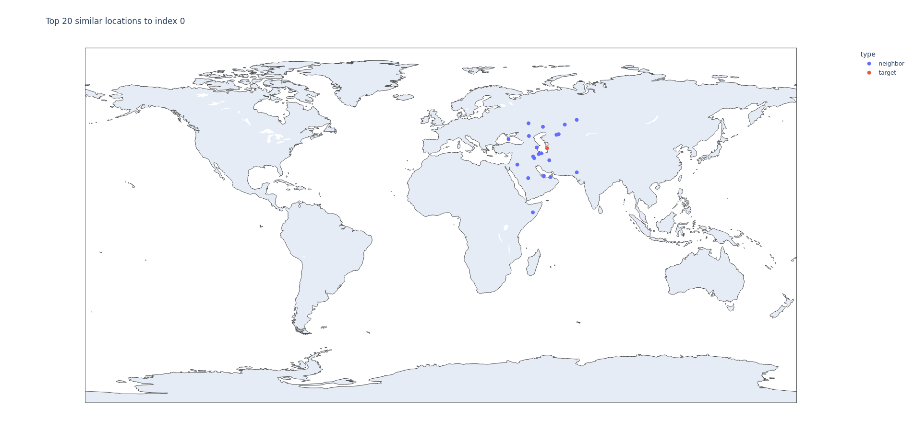

Why add Cartesian coordinates to embeddings
======================================




Motivation
----------

Many embedding vectors encode semantic or feature information but are agnostic
to physical geography. When your data points have latitude/longitude, adding
Cartesian coordinates (x,y,z) derived from lat/lon gives the model an explicit
spatial signal so similarity comparisons can respect geographic proximity as
well as embedding-space similarity.

Consumer decision research frames shopping as a multi-stage process (search/browse, evaluation, then purchase) and shows that transaction costs like shipping are largely stage-dependent: they exert little influence during initial browsing but become decisive at checkout, often triggering cart abandonment ([1](https://en.wikipedia.org/wiki/Consumer_behaviour), [2](https://en.wikipedia.org/wiki/Transaction_cost), [3](https://baymard.com/blog/checkout-usability)). By surfacing spatial signals earlier, such as proximity-based availability, localized pricing, or shipping/pickup estimates, systems can reveal transaction-relevant information during the search/evaluation phase and reduce surprise at checkout. Augmenting embeddings with geographic coordinates therefore not only improves relevance for location-sensitive tasks but also enables operational signals that can improve conversion and reduce abandonment.


What this helps with
---------------------
 - Surface geographic neighbors that are semantically similar.
 - Combine semantic similarity and physical proximity in a single computation
   for latency-sensitive applications.
 - Improve results for latency-sensitive tasks where location matters (recommendations,
  local clustering, geospatial search).

How to add coordinates safely
-----------------------------
1. Convert lat/lon to ECEF (x,y,z) or to unit sphere coordinates. Use a
  stable spherical-earth conversion (functions in `main.py`).
  (ECEF [4](https://en.wikipedia.org/wiki/Earth-centered,_Earth-fixed_coordinate_system))
2. Standardize the coordinate axes (zero mean, unit variance) so they are
  comparable with embedding dimensions.
  (see [5](https://scikit-learn.org/stable/modules/preprocessing.html#standardization-or-mean-removal-and-variance-scaling))
3. Apply a scale/weight to the coordinate vector before concatenating with
   embeddings. This controls how much geography influences similarity.
   - Small scale -> embeddings dominate vs. large scale -> location dominates.
4. Normalize the final vectors (e.g., to unit length) before computing cosine
  similarity so magnitude differences don't skew results.
  (see [6](https://scikit-learn.org/stable/modules/metrics.html#cosine-similarity))


Examples
--------
Below are example outputs showing the same query without geographic
augmentation (before) and with Cartesian coordinates appended (after).

Before (embeddings only):



After (with Cartesian coords):



The examples in this repo demonstrate a before/after effect: the "Before" plot shows neighbors found using embeddings only, and the
"After" plot shows neighbors found after concatenating
standardized Cartesian coordinates to each embedding. Latitude/longitude are
mapped to Cartesian (ECEF) coordinates using a simple spherical-earth
approximation:

$$
x = R \cos(\phi) \cos(\lambda),\\
y = R \cos(\phi) \sin(\lambda),\\
z = R \sin(\phi)
$$

where $\phi$ is latitude, $\lambda$ is longitude (radians) and $R$ is the
earth radius (km). This gives an explicit 3D spatial signal which is
standardized and optionally scaled before concatenation so that geography
influences cosine similarity as intended.

Reference: [4](https://en.wikipedia.org/wiki/Earth-centered,_Earth-fixed_coordinate_system)

Trade-offs and caveats
----------------------
- Adding coordinates increases vector dimensionality and memory/compute cost.
- If not scaled/standardized properly, coordinates can overwhelm the
  embeddings or be ignored entirely.
 - Cartesian coords capture Euclidean/geocentric proximity. For short
   distances this approximates great-circle distance, but consider haversine or
   dedicated geodesic handling for precise distance calculations.
  (see [7](https://en.wikipedia.org/wiki/Haversine_formula))

Practical tips
--------------
- Experiment with a small grid of scale factors (e.g., 0.1, 1, 10) and
  evaluate retrieval precision/recall for your use case.
- Use unit vectors for direction-only signals when absolute distance is
  irrelevant. Use scaled km values when distance magnitude matters.
- When computing neighbors, consider returning both embedding similarity and
  geographic distance to let downstream logic balance them.

Usage (in this repo)
---------------------
- `main.py` provides `latlon_to_xyz(...)`, `get_top_k_similar(...)` and
  `plot_similar_locations(...)`.
- `get_top_k_similar(index, top_k=20, use_cartesian=False, path="data/dummy_embeddings.csv")`
  will compute the top-k by cosine similarity. Set `use_cartesian=True` to
  concatenate standardized Cartesian coords to embeddings (and the code
  applies a small scale factor by default).
- `plot_similar_locations(...)` saves an interactive HTML map to `plots/`.

Quick test
----------
Install dependencies and run a simple call:

```bash
python3 -m pip install --user numpy pandas plotly
python3 -c "from main import get_top_k_similar; get_top_k_similar(0,20,True)"
```

The generated HTML will be in `plots/similar_target0_k20_cart1.html`.


Extending to other applications
-------
Extending embeddings with Cartesian coordinates is a simple and effective way to
inject geographic awareness into vector search. With careful scaling and
normalization it helps produce results that balance both semantic similarity
and spatial proximity. The example here is a simple implementation which drives
scores toward the geographic target with a given shape and strength. This logic,
however, extends beyond this and can be used for any desired weight and decay shape.

References
----------
1. Consumer behaviour (decision stages): https://en.wikipedia.org/wiki/Consumer_behaviour
2. Transaction cost (theory): https://en.wikipedia.org/wiki/Transaction_cost
3. Checkout / cart-abandonment & shipping salience: https://baymard.com/blog/checkout-usability
4. ECEF / geocentric coordinates (lat/lon → x,y,z): https://en.wikipedia.org/wiki/Earth-centered,_Earth-fixed_coordinate_system
5. Feature scaling / StandardScaler / normalization: https://scikit-learn.org/stable/modules/preprocessing.html#standardization-or-mean-removal-and-variance-scaling
6. Cosine similarity / L2 normalization: https://scikit-learn.org/stable/modules/metrics.html#cosine-similarity
7. Haversine / great-circle distances: https://en.wikipedia.org/wiki/Haversine_formula
8. Curse of dimensionality (trade-offs for high-dim vectors): https://en.wikipedia.org/wiki/Curse_of_dimensionality
